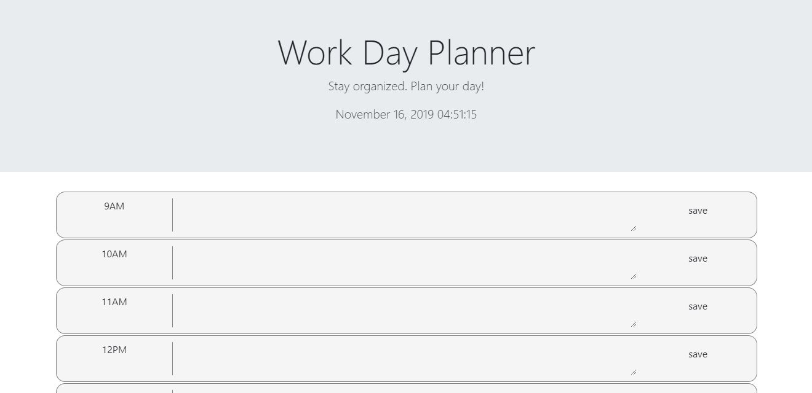

## Description
This website was created for homework assignment #5 at the Coding Boot Camp at Johns Hopkins University. It is a simple day planner application that allows users to schedule their work day.

Use the text areas next to each time slot to write your daily tasks, and press the "save" button to save to your local storage. The time slots change color based on past, present, and future. The present time slot is gold, past time slots are grey, and future slots are green. The application also displays the current time and date. 

Link to deployed site: 
https://jordynsaltzman.github.io/day-planner/

Screenshot of site:

## Acknowledgements

This website was created as part of the Johns Hopkins Coding Bootcamp curriculum. Thank you to my instructors, Stetson Lewis and Donald Hesler, for providing direction and assistance. Also, special thanks to Keisha Shepherd for assisting me with my code. 

## License 

MIT License

Copyright (c) 2019 Jordyn Saltzman

Permission is hereby granted, free of charge, to any person obtaining a copy
of this software and associated documentation files (the "Software"), to deal
in the Software without restriction, including without limitation the rights
to use, copy, modify, merge, publish, distribute, sublicense, and/or sell
copies of the Software, and to permit persons to whom the Software is
furnished to do so, subject to the following conditions:

The above copyright notice and this permission notice shall be included in all
copies or substantial portions of the Software.

THE SOFTWARE IS PROVIDED "AS IS", WITHOUT WARRANTY OF ANY KIND, EXPRESS OR
IMPLIED, INCLUDING BUT NOT LIMITED TO THE WARRANTIES OF MERCHANTABILITY,
FITNESS FOR A PARTICULAR PURPOSE AND NONINFRINGEMENT. IN NO EVENT SHALL THE
AUTHORS OR COPYRIGHT HOLDERS BE LIABLE FOR ANY CLAIM, DAMAGES OR OTHER
LIABILITY, WHETHER IN AN ACTION OF CONTRACT, TORT OR OTHERWISE, ARISING FROM,
OUT OF OR IN CONNECTION WITH THE SOFTWARE OR THE USE OR OTHER DEALINGS IN THE
SOFTWARE.

